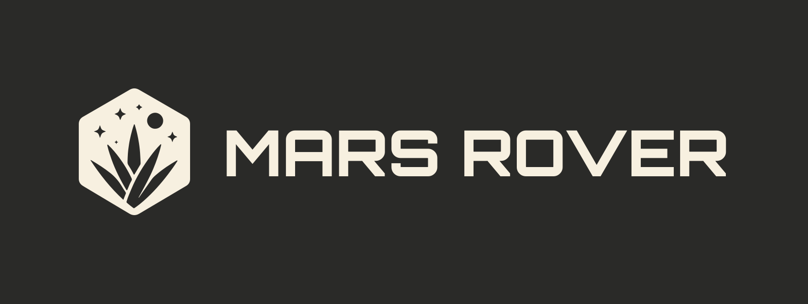
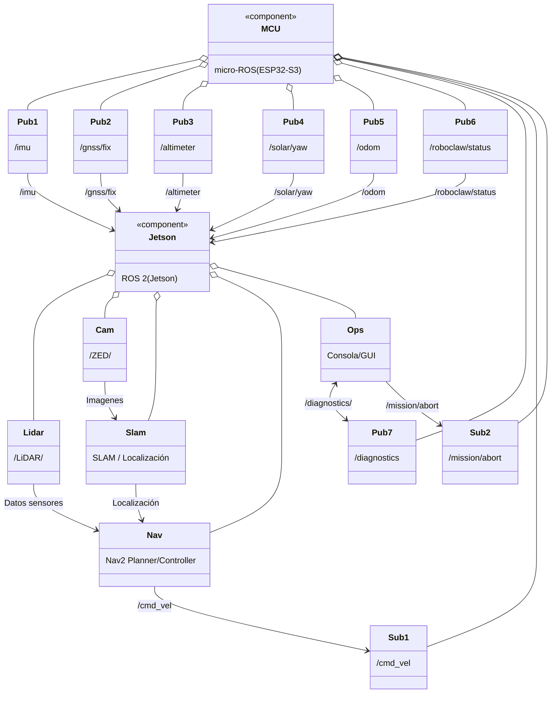

<p align="center">
  
</p>

# Autonomous Navigation Mission 2026 - Maya Rover

This repository contains the Mars Rover UdeG Space **Autonomous Navigation Mission** stack for rover *Maya* in the University Rover Challenge 2026.
It implements a ROS 2–based perception → planning → control pipeline that uses LiDAR, ZED camera, GNSS, IMU and MCU telemetry to navigate up to 2 km, reach GNSS/visual/object targets within competition tolerances, and report status to operators.
Development is done simulation-first (Gazebo/Ignition) and then transferred to the real rover for field testing.

---



---

## Project Structure

| Folder            | What’s inside                                                                           |
| ----------------- | --------------------------------------------------------------------------------------- |
| `src/`            | ROS 2 packages (e.g. `maya_nav2`, `maya_bringup`, `maya_perception`, `maya_mcu_bridge`) |
| `launch/`         | Top-level launch files for simulation and hardware (bringup, Nav2, perception, bridges) |
| `config/`         | YAML configs for Nav2, costmaps, sensors, robot description and MCU/Jetson interfaces   |
| `maps/`           | Saved 2D/3D maps used by localization and planning                                      |
| `sim/`            | Gazebo/Ignition worlds, models, and simulation launch files for the URC environment     |
| `Docs/`           | Mission docs, diagrams, URC rule extracts and notes                                     |
| `LICENSE`         | Project license                                                                         |
| `CONTRIBUTING.md` | Branch workflow, coding standards and contribution guidelines                           |

**(Note: Paths in this table refer to the project root relative to this documentation folder as `..` where applicable)**


### Technical Documentation
*   [**Hardware Specs**](Hardware.md): Robot physical dimensions, mechanics, and sensor details.
*   [**Simulation**](Simulation.md): Gazebo configuration, plugins, and ROS bridge topic map.

## Requirements

### Software
- **OS**: Ubuntu 22.04 (Jammy) / Linux
- **ROS 2**: Humble Hawksbill (or compatible distribution)
- **Simulator**: Gazebo Sim (Garden/Harmonic)

### ROS Packages Dependencies
The following standard ROS 2 packages are required:
- `ros_gz_sim`
- `ros_gz_bridge`
- `robot_state_publisher`
- `xacro`
- `rviz2`

## Installation

1. **Clone the repository**:
   ```bash
   cd ~/projects
   git clone git@github.com:MarsRoverUdeGSpace/AutoNav_Mission_2026.git
   ```

2. **Install dependencies**:
   ```bash
   cd ~/projects/AutoNav_Mission_2026
   rosdep install --from-paths src --ignore-src -r -y
   ```

3. **Build the workspace**:
   ```bash
   colcon build --symlink-install
   ```

4. **Source the setup script**:
   ```bash
   source install/setup.bash
   ```

## Usage

To launch the simulation with the robot, visualization (RViz), and sensor bridges, run:

```bash
ros2 launch maya_bringup maya.launch.xml
```

### Components Launched
- **Gazebo Sim**: Loads an empty world with the Maya rover.
- **Robot State Publisher**: Publishes the robot's TF tree.
- **Ros Gz Bridge**: Bridges topics between ROS 2 and Gazebo.
- **RViz2**: Visualizes the robot model and sensor data.

## Robot Description (Maya)

### Drive System
- **Type**: Skid Steer / Differential Drive
- **Configuration**: 4 Wheels (`front_left`, `front_right`, `back_left`, `back_right`)
- **Control Topic**: `/cmd_vel` (`geometry_msgs/Twist`)
- **Odometry Topic**: `/odom`

### Sensors

| Sensor | ROS Topic | Update Rate | Description |
|--------|-----------|-------------|-------------|
| **LiDAR** | `/scan` | 10 Hz | 360° GPU Lidar, Range: 0.08m - 10.0m |
| **IMU** | `/imu` | 100 Hz | Accelerometer & Gyroscope |
| **Joint States** | `/joint_states` | - | Wheel positions and velocities |

## Topics Interface

The simulation exposes the following bridged topics:

- **Subscribers**:
  - `/cmd_vel`: Velocity commands for the robot.

- **Publishers**:
  - `/scan`: Laser scan data.
  - `/imu`: IMU data.
  - `/odom`: Odometry data.
  - `/tf`: Transform tree.
  - `/joint_states`: Joint states.
  - `/clock`: Simulation time.

## Contributing
Please refer to [../CONTRIBUTING.md](../CONTRIBUTING.md) for guidelines.
